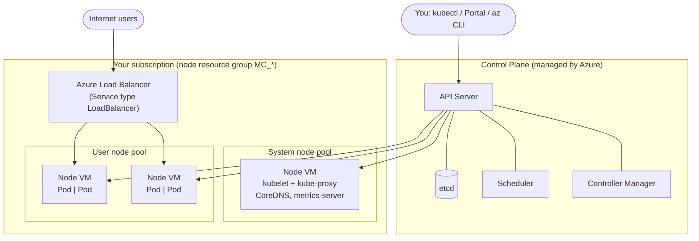

# Azure Kubernetes Service (AKS): Theory and Cluster Setup Guide

> **Official reference:** [Quickstart: Deploy an AKS cluster using the Azure portal](https://learn.microsoft.com/en-us/azure/aks/learn/quick-kubernetes-deploy-portal?tabs=azure-cli)

---

## Part 1: A little theory

**Azure Kubernetes Service (AKS)** is Azure's managed Kubernetes service. Azure runs the **control plane** for you; you manage the **worker nodes** (Azure VMs) and your apps.

### Architecture



### Key terms

| Term | Meaning |
|---|---|
| **Node pool** | Group of VMs of the same size. One *system* pool is required; *user* pools run your apps. |
| **Pod** | Smallest unit: one or more containers. |
| **Deployment** | Desired state of pods (image, replicas, rolling updates). |
| **Service** | Stable IP/DNS for pods; `LoadBalancer` type gives a public IP. |

**Pricing:** the Free tier control plane costs nothing (no SLA). Standard and Premium add an uptime SLA. On every tier you pay for the node VMs, disks, and public IPs.

---

## Part 2: Setting up an AKS cluster with the Azure portal

### Prerequisites

- An Azure subscription (a [free account](https://azure.microsoft.com/free/) works)
- Permission to create resources (for example, the **Contributor** role)
- Basic familiarity with Kubernetes concepts (see Part 1)

### Step 1: Create the cluster

1. Sign in to the [Azure portal](https://portal.azure.com).
2. Select **Create a resource** → **Containers** → **Azure Kubernetes Service (AKS)** → **Create**.
3. On the **Basics** tab, fill in:

   | Field | Example value |
   |---|---|
   | Subscription | Your subscription |
   | Resource group | **Create new** → `aks-resource-group` |
   | Cluster preset configuration | **Dev/Test** |
   | Kubernetes cluster name | `my-aks-cluster` |
   | Region | e.g. `East US 2` / `Central India` |
   | Availability zones | None (fine for dev/test) |
   | AKS pricing tier | **Free** |
   | Kubernetes version | Default |
   | Automatic upgrade | Enabled with patch (recommended) |
   | Authentication and Authorization | Local accounts with Kubernetes RBAC |

4. On the **Node pools** tab:
   - Select the default **agentpool** and review the node size (for example, `Standard_DS2_v2`) and the node count (scale method **Manual**, count **1–2** for testing).
   - Optional: select **Add node pool** to create a separate *User* pool for application workloads.
5. Leave **Networking**, **Integrations**, **Monitoring**, and the remaining tabs at their defaults for a quickstart.
6. Select **Review + create**. After validation passes, select **Create**.
7. Wait a few minutes for deployment to finish, then select **Go to resource**.

### Step 2: Connect to the cluster

You manage the cluster with `kubectl`, the Kubernetes command-line client. Azure Cloud Shell already has both `az` and `kubectl` installed.

1. **Open Cloud Shell.** In the Azure portal, select the `>_` icon in the top bar, or open your AKS resource and select **Connect** → **Open Cloud Shell**. Choose **Bash** when prompted.

2. **Sign in to Azure.** Cloud Shell usually signs you in automatically, so you can skip this step there. Run it if a command reports an authentication error, or when you work from your own machine:

   ```bash
   az login
   ```

   If you have more than one subscription, switch to the one that contains the cluster:

   ```bash
   az account set --subscription "<subscription-name-or-id>"
   ```

3. **Download the credentials to connect to your AKS cluster.** This merges the cluster's connection details into `~/.kube/config` and makes it the current `kubectl` context:

   ```bash
   az aks get-credentials --resource-group aks-resource-group --name my-aks-cluster
   ```

   > Replace `aks-resource-group` and `my-aks-cluster` with the names you chose in Step 1. Add `--overwrite-existing` if a context with the same name already exists.

4. **Verify the cluster connection:**

   ```bash
   kubectl get nodes
   ```

   Expected output: each node is listed with `STATUS` = `Ready`, for example:

   ```text
   NAME                                STATUS   ROLES    AGE   VERSION
   aks-agentpool-12345678-vmss000000   Ready    <none>   5m    v1.xx.x
   ```

> **Working from your own machine instead of Cloud Shell?** Install the [Azure CLI](https://learn.microsoft.com/en-us/cli/azure/install-azure-cli), run `az aks install-cli` to install `kubectl`, then follow steps 2–4 above.

### Step 3: Deploy a sample application

The quickstart deploys the **AKS Store** demo application, which includes:

| Service | Role |
|---|---|
| `store-front` | Web UI for customers |
| `product-service` | Product catalog API |
| `order-service` | Places orders |
| `rabbitmq` | Message queue for orders |

Create a file named `aks-store-quickstart.yaml`. You can copy the full manifest from the [quickstart page](https://learn.microsoft.com/en-us/azure/aks/learn/quick-kubernetes-deploy-portal?tabs=azure-cli#deploy-the-application) or from the [AKS Store demo repo](https://github.com/Azure-Samples/aks-store-demo). Then apply it:

```bash
kubectl apply -f aks-store-quickstart.yaml
```

You can also apply the manifest straight from the repo:

```bash
kubectl apply -f https://raw.githubusercontent.com/Azure-Samples/aks-store-demo/main/aks-store-quickstart.yaml
```

> **Alternative (portal only):** On your AKS resource, select **Kubernetes resources** → **Workloads** → **Create** → **Apply a YAML**, paste the manifest, and select **Add**.

### Step 4: Test the application

```bash
kubectl get pods
```

```bash
kubectl get service store-front --watch
```

Wait until `EXTERNAL-IP` changes from `<pending>` to a public IP address, then press `Ctrl+C`. Open `http://<EXTERNAL-IP>` in a browser to see the store front.

### Step 5: Clean up resources (avoid charges)

Delete the resource group to remove the cluster, its node resource group (`MC_...`), and everything else in it:

- **Portal:** Resource groups → `aks-resource-group` → **Delete resource group**

or

```bash
az group delete --name aks-resource-group --yes --no-wait
```

---

## Part 3: Handy `kubectl` cheat sheet

| Command | Purpose |
|---|---|
| `kubectl get nodes` | List cluster nodes |
| `kubectl get pods -A` | List pods in all namespaces |
| `kubectl get svc` | List services |
| `kubectl describe pod <name>` | Show detailed info and events for a pod |
| `kubectl logs <pod>` | Show container logs |
| `kubectl exec -it <pod> -- sh` | Open a shell inside a container |
| `kubectl scale deployment <name> --replicas=3` | Scale a deployment |
| `kubectl delete -f <file>.yaml` | Delete the resources defined in a file |

### Useful `az aks` commands

| Command | Purpose |
|---|---|
| `az aks list -o table` | List AKS clusters |
| `az aks show -g <rg> -n <cluster>` | Show cluster details |
| `az aks scale -g <rg> -n <cluster> --node-count 3` | Scale the node count |
| `az aks stop -g <rg> -n <cluster>` | Stop the cluster (saves cost) |
| `az aks start -g <rg> -n <cluster>` | Start a stopped cluster |
| `az aks upgrade -g <rg> -n <cluster> --kubernetes-version <ver>` | Upgrade Kubernetes |

---

## Further reading

- [Quickstart: Deploy AKS using the Azure portal](https://learn.microsoft.com/en-us/azure/aks/learn/quick-kubernetes-deploy-portal?tabs=azure-cli)
- [Core Kubernetes concepts for AKS](https://learn.microsoft.com/en-us/azure/aks/concepts-clusters-workloads)
- [AKS networking concepts](https://learn.microsoft.com/en-us/azure/aks/concepts-network)
- [AKS best practices](https://learn.microsoft.com/en-us/azure/aks/best-practices)
- [AKS pricing tiers](https://learn.microsoft.com/en-us/azure/aks/free-standard-pricing-tiers)
