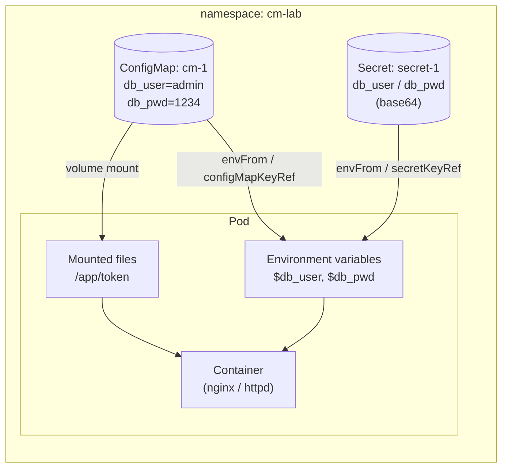

# Lab: ConfigMaps & Secrets on AKS

## Theory

### Why do we need them?
Applications need configuration: database names, URLs, feature flags, usernames, passwords. Hard-coding these into the container image or the Pod YAML (as Task 1 does) means:
- the image or YAML must change for every environment (dev / test / prod)
- passwords end up in plain text in YAML files and Git

Kubernetes solves this by **decoupling configuration from the application**. The config is stored as a separate object and **injected** into the Pod at runtime, so one image runs everywhere.

### What is a ConfigMap?
A **ConfigMap** is a Kubernetes object that stores **non-sensitive configuration data** as **key-value pairs**.
- Values can be short strings (`db_user=admin`) or whole files (`nginx.conf`, `app.properties`)
- Size limit: **1 MiB**
- Stored in **plain text** in etcd
- Namespaced: a Pod can only use ConfigMaps in its own namespace

Ways to create one:
```
kubectl create cm <name> --from-literal=key=value     # from key-value pairs
kubectl create cm <name> --from-file=<file>           # file name = key, file content = value
kubectl apply -f configmap.yaml                       # declarative
```

### What is a Secret?
A **Secret** is like a ConfigMap but meant for **sensitive data**: passwords, tokens, keys, certificates.
- Values are stored **base64 encoded** (`data:`). Base64 is an **encoding, not encryption**: anyone who can read the Secret can decode it.
- Kept separate from ConfigMaps so access can be restricted with **RBAC**
- Mounted into Pods through **tmpfs** (in memory), never written to the node's disk
- Size limit: **1 MiB**

Common Secret types:

| Type | Use |
|---|---|
| `Opaque` | Generic key-value data (default; used in this lab) |
| `kubernetes.io/tls` | TLS certificate + private key (e.g. for Ingress) |
| `kubernetes.io/dockerconfigjson` | Credentials for a private container registry |
| `kubernetes.io/service-account-token` | Service account token |

> On AKS, keep production secrets in **Azure Key Vault** and mount them with the **Secrets Store CSI Driver** add-on, instead of storing them only as Kubernetes Secrets.

### ConfigMap vs Secret
| | ConfigMap | Secret |
|---|---|---|
| Data | Non-sensitive config | Sensitive data |
| Storage format | Plain text | Base64 encoded |
| YAML field | `data:` | `data:` (base64) / `stringData:` (plain) |
| `kubectl describe` shows values | ✅ Yes | ❌ No (only sizes) |
| Example | App mode, URLs, config files | Passwords, API keys, TLS certs |



---

## Prerequisites – Connect to the existing AKS cluster
Log in to Azure:
```
az login
```
Download the credentials of your AKS cluster:
```
az aks get-credentials --resource-group <your-resource-group> --name <your-aks-cluster-name>
```
Verify the cluster nodes are `Ready`:
```
kubectl get nodes
```
Create a namespace named **cm-lab** for this lab:
```
kubectl create ns cm-lab
```
Set **cm-lab** as the default namespace for all the following commands:
```
kubectl config set-context --current --namespace=cm-lab
```

---

## Task 1: Inject variables directly into a Pod
Create a file named **env.yaml**:
```
vi env.yaml
```
Copy the following content into **env.yaml**, then save and exit (`Esc` → `:wq`):
```yaml
apiVersion: v1
kind: Pod
metadata:
  labels:
    app: ws
  name: env-pod
spec:
  containers:
  - image: nginx
    name: ng-ctr
    ports:
    - containerPort: 80
    env:
    - name: db_user
      value: admin
    - name: db_pwd
      value: "1234"
```
Create the pod from the file:
```
kubectl apply -f env.yaml
```
Check the pod details; the variables are listed under **Environment**:
```
kubectl describe pod env-pod
```
Open a shell inside the pod:
```
kubectl exec -it env-pod -- sh
```
Print the variables (expected: `db_user=admin`, `db_pwd=1234`):
```
env | grep db_
```
Exit the pod shell:
```
exit
```
Delete the pod:
```
kubectl delete pod env-pod
```

---

## Task 2: Inject `ALL` variables from a ConfigMap
Create a ConfigMap named **cm-1** with two key-value pairs:
```
kubectl create cm cm-1 --from-literal=db_user=admin --from-literal=db_pwd=1234
```
Check the ConfigMap data:
```
kubectl describe cm cm-1
```
Open **env.yaml** again and replace its content:
```
vi env.yaml
```
Copy the following content into **env.yaml**, then save and exit (`Esc` → `:wq`):
```yaml
apiVersion: v1
kind: Pod
metadata:
  labels:
    app: web
  name: web-pod
spec:
  containers:
  - image: httpd
    name: ctr-1
    ports:
    - containerPort: 80
    envFrom:
    - configMapRef:
        name: cm-1
```
Create the pod from the file:
```
kubectl apply -f env.yaml
```
Check the pod details; **Environment Variables from** shows `cm-1`:
```
kubectl describe pod web-pod
```
Open a shell inside the pod:
```
kubectl exec -it web-pod -- sh
```
Print the variables (expected: `db_user=admin`, `db_pwd=1234`):
```
env | grep db_
```
Exit the pod shell:
```
exit
```
Delete the pod (keep **cm-1** for Task 3):
```
kubectl delete pod web-pod
```

---

## Task 3: Inject a `PARTICULAR` variable from a ConfigMap
Open **env.yaml** again and replace its content:
```
vi env.yaml
```
Copy the following content into **env.yaml**, then save and exit (`Esc` → `:wq`). Only the `db_pwd` key of **cm-1** is injected, under the name `db_password`:
```yaml
apiVersion: v1
kind: Pod
metadata:
  labels:
    app: web
  name: web-pod
spec:
  containers:
  - image: httpd
    name: ctr-1
    ports:
    - containerPort: 80
    env:
    - name: db_password
      valueFrom:
        configMapKeyRef:
          name: cm-1
          key: db_pwd
```
Create the pod from the file:
```
kubectl apply -f env.yaml
```
Check the pod details:
```
kubectl describe pod web-pod
```
Open a shell inside the pod:
```
kubectl exec -it web-pod -- sh
```
Print the variables (expected: only `db_password=1234`; `db_user` and `db_pwd` are not set):
```
env | grep db_
```
Exit the pod shell:
```
exit
```
Delete the pod:
```
kubectl delete pod web-pod
```
Delete the ConfigMap:
```
kubectl delete cm cm-1
```

---

## Task 4: Mount a ConfigMap as a volume
Create a file named **token**:
```
vi token
```
Copy the following text into **token**, then save and exit (`Esc` → `:wq`):
```
This is CKAD Training. We are practicing mounting a ConfigMap as a volume.
```
Create a ConfigMap named **cm-1** from the file (the file name `token` becomes the key):
```
kubectl create cm cm-1 --from-file=token
```
Check the ConfigMap data:
```
kubectl describe cm cm-1
```
Open **env.yaml** again and replace its content:
```
vi env.yaml
```
Copy the following content into **env.yaml**, then save and exit (`Esc` → `:wq`). The ConfigMap is mounted at `/app`:
```yaml
apiVersion: v1
kind: Pod
metadata:
  labels:
    app: web
  name: web-pod
spec:
  volumes:
  - name: cm-volume
    configMap:
      name: cm-1
  containers:
  - image: httpd
    name: ctr-1
    ports:
    - containerPort: 80
    volumeMounts:
    - name: cm-volume
      mountPath: /app
```
Create the pod from the file:
```
kubectl apply -f env.yaml
```
Check the pod details; **Mounts** shows `/app`:
```
kubectl describe pod web-pod
```
Open a shell inside the pod:
```
kubectl exec -it web-pod -- sh
```
Print the mounted file (expected: the text from the **token** file):
```
cat /app/token
```
Exit the pod shell:
```
exit
```
Delete the pod:
```
kubectl delete pod web-pod
```
Delete the ConfigMap:
```
kubectl delete cm cm-1
```

---

## Task 5: Secrets

### Imperative
Create a Secret named **secret-1** with two key-value pairs:
```
kubectl create secret generic secret-1 --from-literal=db_user=admin --from-literal=db_pwd=123
```
Check the Secret (values are hidden, only sizes are shown):
```
kubectl describe secret secret-1
```

### Declarative
Values under `data:` must be base64 encoded. Example of encoding a value (use `echo -n`, so no newline is encoded):
```
echo -n 'root' | base64
```
Create a file named **secret.yaml**:
```
vi secret.yaml
```
Copy the following content into **secret.yaml**, then save and exit (`Esc` → `:wq`):
```yaml
apiVersion: v1
kind: Secret
metadata:
  name: mysql-credentials
type: Opaque
data:
  rootpw: cm9vdA==      # root
  user: dXNlcg==        # user
  password: bXlwd2Q=    # mypwd
```
Create the Secret from the file:
```
kubectl apply -f secret.yaml
```
Check the Secret:
```
kubectl describe secret mysql-credentials
```

### Inject both Secrets into a Pod
Create a file named **sc-pod.yaml**:
```
vi sc-pod.yaml
```
Copy the following content into **sc-pod.yaml**, then save and exit (`Esc` → `:wq`):
```yaml
apiVersion: v1
kind: Pod
metadata:
  labels:
    run: sc-pod
  name: sc-pod
spec:
  containers:
  - image: nginx
    name: sc-ctr
    envFrom:
    - secretRef:
        name: secret-1
    - secretRef:
        name: mysql-credentials
```
Create the pod from the file:
```
kubectl apply -f sc-pod.yaml
```
Check that the pod is `Running`:
```
kubectl get pod sc-pod
```
Open a shell inside the pod:
```
kubectl exec -it sc-pod -- sh
```
Print the variables (expected: decoded plain-text values `admin`, `123`, `root`, `user`, `mypwd`):
```
env | grep -E 'db_|rootpw|user|password'
```
Exit the pod shell:
```
exit
```

---

## Task 6: Cleanup
Delete the namespace (this deletes all pods, ConfigMaps and Secrets created in this lab):
```
kubectl delete ns cm-lab
```
Switch the default namespace back to **default**:
```
kubectl config set-context --current --namespace=default
```
Delete the local files created in this lab:
```
rm -f env.yaml secret.yaml sc-pod.yaml token
```
