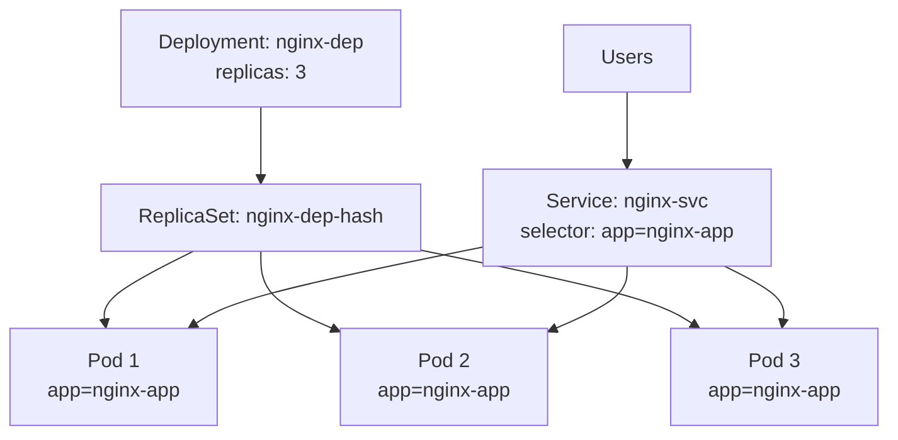
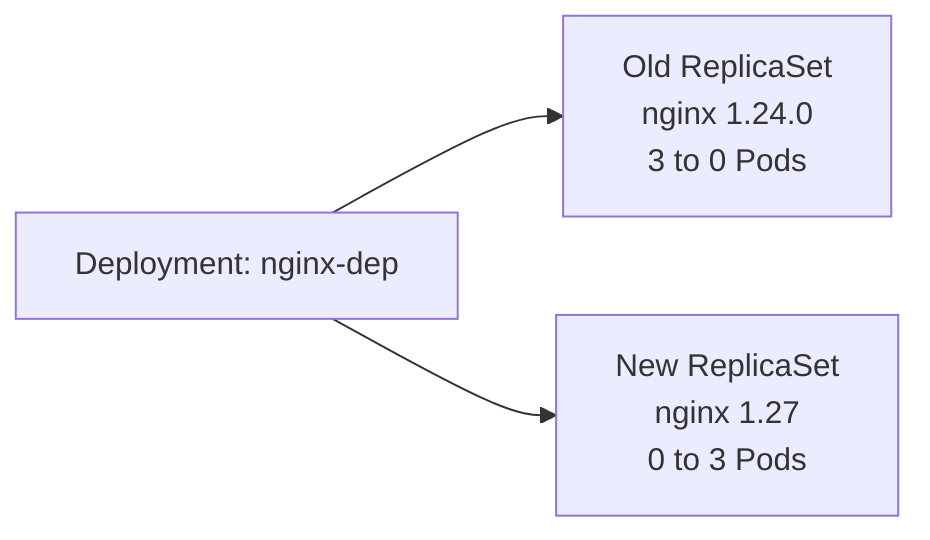

# Lab: Kubernetes Deployments

## What You Will Do

| Step | Topic | You will learn |
|---|---|---|
| 1 | Create a Deployment | Run 3 identical Pods from one YAML |
| 2 | Expose with a Service | Reach the app from the internet |
| 3 | Self-healing | See Kubernetes replace a deleted Pod |
| 4 | Rolling update | Upgrade the app version without downtime |
| 5 | Rollback | Go back to the previous version |
| 6 | Manual scaling | Increase or decrease the number of Pods |
| 7 | Autoscaling (HPA) | Let Kubernetes scale Pods based on CPU |
| 8 | Cleanup | Remove everything |

## Before You Start

You need an AKS cluster with `kubectl` connected (see the [AKS Cloud Shell lab](AKS-CloudShell-Lab.md)). You should also have finished the [Pods](K8s-Namespaces-Pods-Labels-Lab.md) and [Services](K8s-Services-Lab.md) labs.

```bash
kubectl get nodes
```

Expected output: nodes with `STATUS` = `Ready`.

---

## Key Concepts

### What Is a Deployment?

In the Pods lab, you saw that a Pod you delete is gone forever. In real projects, you don't create Pods directly. You create a **Deployment**: you tell it *what* to run and *how many copies*, and Kubernetes keeps that **desired state** true at all times.

A Deployment doesn't manage Pods itself. It creates a **ReplicaSet**, and the ReplicaSet creates and watches the Pods.



> Diagram not showing? [View it as an image](https://mermaid.ink/img/Zmxvd2NoYXJ0IFRCCiAgICBVWyJVc2VycyJdIC0tPiBTWyJTZXJ2aWNlOiBuZ2lueC1zdmM8YnIvPnNlbGVjdG9yOiBhcHA9bmdpbngtYXBwIl0KICAgIERbIkRlcGxveW1lbnQ6IG5naW54LWRlcDxici8-cmVwbGljYXM6IDMiXSAtLT4gUlNbIlJlcGxpY2FTZXQ6IG5naW54LWRlcC1oYXNoIl0KICAgIFJTIC0tPiBQMVsiUG9kIDE8YnIvPmFwcD1uZ2lueC1hcHAiXQogICAgUlMgLS0-IFAyWyJQb2QgMjxici8-YXBwPW5naW54LWFwcCJdCiAgICBSUyAtLT4gUDNbIlBvZCAzPGJyLz5hcHA9bmdpbngtYXBwIl0KICAgIFMgLS0-IFAxCiAgICBTIC0tPiBQMgogICAgUyAtLT4gUDMK).

| Object | Job |
|---|---|
| **Deployment** | Holds the desired state (image, replicas, update strategy) and manages updates and rollbacks |
| **ReplicaSet** | Keeps exactly *N* Pods running. The Deployment creates a new ReplicaSet for every new version. |
| **Pod** | Runs the container. Its labels must match the Deployment's `selector`. |

### Why Use Deployments?

| Feature | Meaning |
|---|---|
| **Self-healing** | When a Pod crashes or is deleted, a new one is created automatically |
| **Scaling** | Change the number of Pods with one command, or automatically with HPA |
| **Rolling updates** | Replaces Pods gradually with a new version, so users see no downtime |
| **Rollback** | Return to a previous version if an update goes wrong |
| **Declarative** | You describe the desired state in YAML; Kubernetes does the work |

### Update Strategies

| Strategy | How it works | Downtime |
|---|---|---|
| **RollingUpdate** (default) | Starts new Pods and removes old ones a few at a time | No |
| **Recreate** | Deletes **all** old Pods first, then creates new ones | Yes |

During a rolling update, the Deployment creates a **new ReplicaSet** and shifts Pods to it gradually:



> Diagram not showing? [View it as an image](https://mermaid.ink/img/Zmxvd2NoYXJ0IExSCiAgICBEWyJEZXBsb3ltZW50OiBuZ2lueC1kZXAiXSAtLT4gT0xEWyJPbGQgUmVwbGljYVNldDxici8-bmdpbnggMS4yNC4wPGJyLz4zIHRvIDAgUG9kcyJdCiAgICBEIC0tPiBORVdbIk5ldyBSZXBsaWNhU2V0PGJyLz5uZ2lueCAxLjI3PGJyLz4wIHRvIDMgUG9kcyJdCg==).

---

## Step 1: Create a Deployment

**1.1: Create a namespace for this lab and make it your default**

```bash
kubectl create ns deploy-lab
```

```bash
kubectl config set-context --current --namespace=deploy-lab
```

**1.2: Create the Deployment YAML**

```bash
cat <<EOF > dep-nginx.yaml
apiVersion: apps/v1
kind: Deployment
metadata:
  name: nginx-dep
spec:
  replicas: 3                    # desired number of Pods
  strategy:
    type: RollingUpdate          # update Pods gradually (no downtime)
  selector:
    matchLabels:
      app: nginx-app             # manage Pods that have this label
  template:                      # blueprint for every Pod
    metadata:
      labels:
        app: nginx-app           # must match the selector above
    spec:
      containers:
        - name: nginx-ctr
          image: nginx:1.24.0
          ports:
            - containerPort: 80
          resources:
            requests:
              cpu: "50m"         # required for autoscaling in Step 7
              memory: "64Mi"
            limits:
              cpu: "100m"
              memory: "128Mi"
EOF
```

**1.3: Apply it**

```bash
kubectl apply -f dep-nginx.yaml
```

**1.4: See the three levels Kubernetes created**

```bash
kubectl get deployments
```

Expected output: `nginx-dep` with `READY` = `3/3`.

```bash
kubectl get rs
```

Expected output: one ReplicaSet named `nginx-dep-<hash>` with `DESIRED` = `3`.

```bash
kubectl get pods --show-labels
```

Expected output: 3 Pods named `nginx-dep-<hash>-<random>`, all with the label `app=nginx-app`.

**1.5: Check the nginx version**

`deploy/nginx-dep` tells `kubectl` to pick one of the Deployment's Pods for you:

```bash
kubectl exec deploy/nginx-dep -- nginx -v
```

Expected output: `nginx version: nginx/1.24.0`

---

## Step 2: Expose the Deployment with a Service

**2.1: Create a LoadBalancer Service**

The Service selects Pods with the label `app=nginx-app`, the same label the Deployment puts on its Pods.

```bash
cat <<EOF > nginx-svc.yaml
apiVersion: v1
kind: Service
metadata:
  name: nginx-svc
spec:
  type: LoadBalancer
  selector:
    app: nginx-app
  ports:
    - port: 80
      targetPort: 80
EOF
```

```bash
kubectl apply -f nginx-svc.yaml
```

**2.2: Wait for the public IP**

```bash
kubectl get svc nginx-svc --watch
```

When `EXTERNAL-IP` changes from `<pending>` to an IP address, press `Ctrl+C`. Save the IP in a variable:

```bash
SVC_IP=$(kubectl get svc nginx-svc -o jsonpath='{.status.loadBalancer.ingress[0].ip}')
echo $SVC_IP
```

**2.3: Check the app and its version**

```bash
curl -sI http://$SVC_IP | grep Server
```

Expected output: `Server: nginx/1.24.0`. You can also open `http://<EXTERNAL-IP>` in a browser.

```bash
kubectl describe svc nginx-svc | grep Endpoints
```

Expected output: **3 Pod IPs**. The Service load-balances across all three Pods.

---

## Step 3: Self-Healing

**3.1: Delete one Pod**

```bash
kubectl delete pod $(kubectl get pods -l app=nginx-app -o jsonpath='{.items[0].metadata.name}')
```

**3.2: Check the Pods again**

```bash
kubectl get pods
```

Expected output: still **3** Pods. One of them has a very young `AGE`. The ReplicaSet noticed only 2 were running and created a replacement.

---

## Step 4: Rolling Update

**4.1: Record a reason for the current version** (it appears in the rollout history)

```bash
kubectl annotate deployment nginx-dep kubernetes.io/change-cause="nginx 1.24.0 initial version"
```

**4.2: Update the image to a newer version**

```bash
kubectl set image deployment/nginx-dep nginx-ctr=nginx:1.27
```

```bash
kubectl annotate deployment nginx-dep kubernetes.io/change-cause="update to nginx 1.27"
```

**4.3: Watch the rollout**

```bash
kubectl rollout status deployment/nginx-dep
```

Expected output: messages as Pods are replaced one by one, ending with `successfully rolled out`.

**4.4: See what changed**

```bash
kubectl get rs
```

Expected output: **two** ReplicaSets. The old one has `DESIRED` = `0`, and the new one has `DESIRED` = `3`. Kubernetes keeps the old ReplicaSet so it can roll back.

```bash
curl -sI http://$SVC_IP | grep Server
```

Expected output: `Server: nginx/1.27.x`. The app stayed reachable through the same IP during the whole update.

---

## Step 5: Rollback

**5.1: View the rollout history**

```bash
kubectl rollout history deployment/nginx-dep
```

Expected output:

```text
REVISION  CHANGE-CAUSE
1         nginx 1.24.0 initial version
2         update to nginx 1.27
```

**5.2: Roll back to revision 1**

```bash
kubectl rollout undo deployment/nginx-dep --to-revision=1
```

```bash
kubectl rollout status deployment/nginx-dep
```

**5.3: Verify the version**

```bash
kubectl get rs
```

Expected output: the **original** ReplicaSet has `DESIRED` = `3` again.

```bash
curl -sI http://$SVC_IP | grep Server
```

Expected output: `Server: nginx/1.24.0`

> **Tip:** `kubectl rollout undo deployment/nginx-dep` without `--to-revision` goes back one version.

---

## Step 6: Manual Scaling

**6.1: Scale up to 8 Pods**

```bash
kubectl scale deployment nginx-dep --replicas=8
```

```bash
kubectl get deployment nginx-dep
```

Expected output: `READY` = `8/8`. Run the command again if some Pods are still starting.

```bash
kubectl describe svc nginx-svc | grep Endpoints
```

Expected output: the Service now sends traffic to all 8 Pods automatically. The output may show only the first few IPs followed by `+ N more...`.

**6.2: Scale down to 2 Pods**

```bash
kubectl scale deployment nginx-dep --replicas=2
```

```bash
kubectl get pods
```

Expected output: 2 Pods remain; the extra Pods are terminated.

---

## Step 7: Autoscaling with HPA

A **Horizontal Pod Autoscaler (HPA)** adds or removes Pods based on CPU usage. It compares actual usage with the CPU **request** set in Step 1.2. AKS includes the `metrics-server` that HPA needs.

**7.1: Create the HPA**

Keep between 3 and 8 Pods, and add Pods when average CPU goes above 70% of the request:

```bash
kubectl autoscale deployment nginx-dep --min=3 --max=8 --cpu-percent=70
```

**7.2: Check the HPA**

```bash
kubectl get hpa
```

Expected output: `TARGETS` shows something like `cpu: 0%/70%` (it may show `<unknown>` for the first minute), and `REPLICAS` = `3`.

```bash
kubectl get pods
```

Expected output: **3** Pods. The HPA raised the count from 2 to its minimum of 3.

> **Note:** While an HPA is active, it controls the replica count. If you run `kubectl scale` by hand, the HPA overrides your change.

---

## Step 8: Cleanup

Deleting the namespace removes the Deployment, ReplicaSets, Pods, Service, HPA, and the Azure public IP:

```bash
kubectl delete ns deploy-lab
```

```bash
kubectl config set-context --current --namespace=default
```

```bash
rm -f dep-nginx.yaml nginx-svc.yaml
```

---

## Summary

| Command | Purpose |
|---|---|
| `kubectl apply -f <file>.yaml` | Create or update a Deployment |
| `kubectl get deploy,rs,pods` | View all three levels at once |
| `kubectl set image deployment/<name> <container>=<image>` | Start a rolling update |
| `kubectl rollout status deployment/<name>` | Watch an update |
| `kubectl rollout history deployment/<name>` | View revisions |
| `kubectl rollout undo deployment/<name> [--to-revision=N]` | Roll back |
| `kubectl scale deployment <name> --replicas=N` | Scale manually |
| `kubectl autoscale deployment <name> --min=X --max=Y --cpu-percent=Z` | Create an HPA |
| `kubectl exec deploy/<name> -- <command>` | Run a command in one of the Deployment's Pods |
