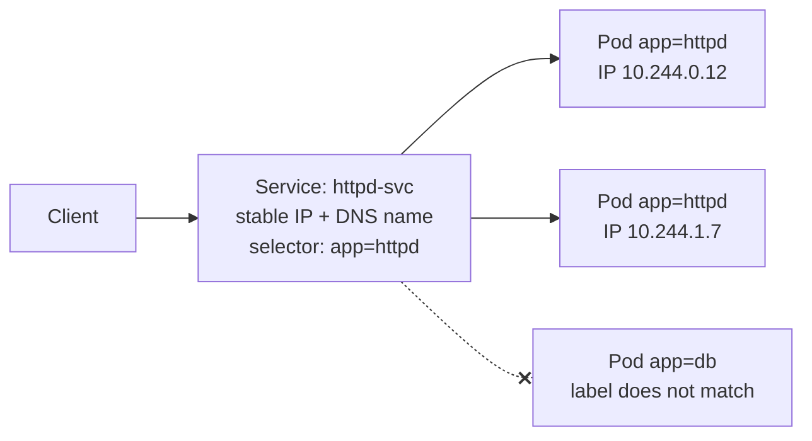
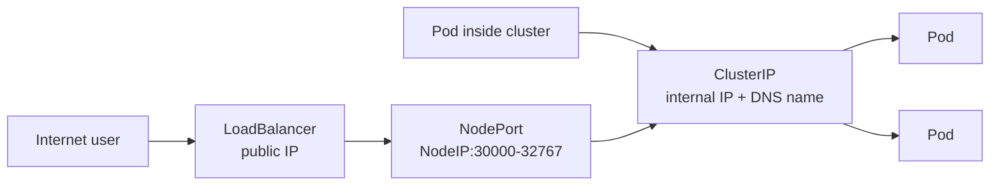

# Lab: Kubernetes Services (ClusterIP, NodePort, LoadBalancer)

## What You Will Do

| Step | Topic | You will learn |
|---|---|---|
| 1 | Setup | Create a lab namespace and an httpd Pod |
| 2 | ClusterIP | Reach the Pod from inside the cluster |
| 3 | NodePort | Open a port on every node |
| 4 | LoadBalancer | Reach the Pod from the internet |
| 5 | Endpoints | See how a Service follows Pods when they change |
| 6 | Cleanup | Remove everything |

## Before You Start

You need an AKS cluster with `kubectl` connected (see the [AKS Cloud Shell lab](AKS-CloudShell-Lab.md)). You should also have finished the [Namespaces, Pods, YAMLs, and Labels lab](K8s-Namespaces-Pods-Labels-Lab.md). Check the connection:

```bash
kubectl get nodes
```

Expected output: nodes with `STATUS` = `Ready`.

---

## Key Concepts

### What Is a Service?

Pods are **temporary**. When a Pod is recreated, it gets a **new IP address**, so clients can't rely on Pod IPs.

A **Service** gives a group of Pods one **stable name and IP address**, and spreads traffic across them.



> Diagram not showing? [View it as an image](https://mermaid.ink/img/Zmxvd2NoYXJ0IExSCiAgICBDWyJDbGllbnQiXSAtLT4gU1siU2VydmljZTogaHR0cGQtc3ZjPGJyLz5zdGFibGUgSVAgKyBETlMgbmFtZTxici8-c2VsZWN0b3I6IGFwcD1odHRwZCJdCiAgICBTIC0tPiBQMVsiUG9kIGFwcD1odHRwZDxici8-SVAgMTAuMjQ0LjAuMTIiXQogICAgUyAtLT4gUDJbIlBvZCBhcHA9aHR0cGQ8YnIvPklQIDEwLjI0NC4xLjciXQogICAgUyAtLi14IFAzWyJQb2QgYXBwPWRiPGJyLz5sYWJlbCBkb2VzIG5vdCBtYXRjaCJdCg==).

### Why Use Services?

| Problem | How a Service solves it |
|---|---|
| Pod IPs change when Pods restart | The Service IP and name stay the same |
| Several Pods run the same app | The Service load-balances across them |
| Apps need to find each other | Pods reach a Service by **name** (for example, `http://httpd-svc`) through cluster DNS |

### How a Service Finds Its Pods

A Service uses a **label selector**. Every Pod whose labels match the selector is added to the Service's **Endpoints**, the list of Pod IPs that receive traffic. Kubernetes updates this list automatically as Pods come and go.

### Service Types

| Type | Reachable from | Typical use |
|---|---|---|
| **ClusterIP** (default) | Inside the cluster only | Communication between apps (frontend to backend, app to database) |
| **NodePort** | `<NodeIP>:<NodePort>` on every node (port range 30000–32767) | Testing, or when you run your own load balancer |
| **LoadBalancer** | A public IP address from the cloud provider (an Azure Load Balancer in AKS) | Public-facing applications |

Each type builds on the previous one: a LoadBalancer Service also has a NodePort and a ClusterIP.



> Diagram not showing? [View it as an image](https://mermaid.ink/img/Zmxvd2NoYXJ0IExSCiAgICBVWyJJbnRlcm5ldCB1c2VyIl0gLS0-IExCWyJMb2FkQmFsYW5jZXI8YnIvPnB1YmxpYyBJUCJdCiAgICBMQiAtLT4gTlBbIk5vZGVQb3J0PGJyLz5Ob2RlSVA6MzAwMDAtMzI3NjciXQogICAgSU5bIlBvZCBpbnNpZGUgY2x1c3RlciJdIC0tPiBDSVBbIkNsdXN0ZXJJUDxici8-aW50ZXJuYWwgSVAgKyBETlMgbmFtZSJdCiAgICBOUCAtLT4gQ0lQCiAgICBDSVAgLS0-IFAxWyJQb2QiXQogICAgQ0lQIC0tPiBQMlsiUG9kIl0K).

### Ports in a Service

| Field | Meaning |
|---|---|
| `port` | The port the **Service** listens on |
| `targetPort` | The port the **container** listens on (where traffic is forwarded) |
| `nodePort` | The port opened on every **node** (NodePort and LoadBalancer types only) |

---

## Step 1: Setup

**1.1: Create a namespace for this lab and make it your default**

```bash
kubectl create ns svc-lab
```

```bash
kubectl config set-context --current --namespace=svc-lab
```

**1.2: Create an httpd Pod with a label**

```bash
cat <<EOF > httpd-pod.yaml
apiVersion: v1
kind: Pod
metadata:
  name: httpd-pod
  labels:
    app: httpd
spec:
  containers:
    - name: httpd-container
      image: httpd
      ports:
        - containerPort: 80
EOF
```

```bash
kubectl apply -f httpd-pod.yaml
```

```bash
kubectl get pods -o wide --show-labels
```

Expected output: `httpd-pod` is `Running` with the label `app=httpd`. Note its **IP** address.

---

## Step 2: ClusterIP Service

**2.1: Create the Service**

The `selector` (`app: httpd`) must match the Pod's label.

```bash
cat <<EOF > httpd-svc.yaml
apiVersion: v1
kind: Service
metadata:
  name: httpd-svc
spec:
  type: ClusterIP
  selector:
    app: httpd
  ports:
    - protocol: TCP
      port: 80
      targetPort: 80
EOF
```

```bash
kubectl apply -f httpd-svc.yaml
```

**2.2: Check the Service**

```bash
kubectl get svc
```

Expected output: `httpd-svc` with `TYPE` = `ClusterIP`, a `CLUSTER-IP`, and `EXTERNAL-IP` = `<none>`.

```bash
kubectl describe svc httpd-svc
```

Look at the **Endpoints** line. It shows the Pod IP from Step 1.2, which means the selector matched the Pod.

**2.3: Test the Service from inside the cluster**

A ClusterIP Service can't be reached from outside the cluster. Start a temporary test Pod and call the Service **by name**:

```bash
kubectl run test-pod --image=busybox --rm -it --restart=Never -- wget -qO- http://httpd-svc
```

Expected output: `<html><body><h1>It works!</h1></body></html>`

`--rm` deletes the test Pod after the command finishes. Calling the Service by name works because of cluster DNS.

---

## Step 3: NodePort Service

**3.1: Change the Service type to NodePort**

```bash
sed -i 's/type: ClusterIP/type: NodePort/' httpd-svc.yaml
```

```bash
grep type httpd-svc.yaml
```

Expected output: `type: NodePort`

```bash
kubectl apply -f httpd-svc.yaml
```

**3.2: Find the NodePort**

```bash
kubectl get svc httpd-svc
```

Expected output: `PORT(S)` shows something like `80:31234/TCP`. Here `80` is the Service port and `31234` is the **NodePort**, which Kubernetes picks from the range 30000–32767.

**3.3: Test the Service through a node's IP and the NodePort**

> **Note:** By default, AKS nodes have only **private** IP addresses, so you can't reach a NodePort from your browser. Test it from inside the cluster with the node's internal IP.

Save the node IP and NodePort into variables:

```bash
NODE_IP=$(kubectl get nodes -o jsonpath='{.items[0].status.addresses[?(@.type=="InternalIP")].address}')
NODE_PORT=$(kubectl get svc httpd-svc -o jsonpath='{.spec.ports[0].nodePort}')
echo $NODE_IP:$NODE_PORT
```

```bash
kubectl run test-pod --image=busybox --rm -it --restart=Never -- wget -qO- http://$NODE_IP:$NODE_PORT
```

Expected output: `<html><body><h1>It works!</h1></body></html>`

---

## Step 4: LoadBalancer Service

**4.1: Change the Service type to LoadBalancer**

```bash
sed -i 's/type: NodePort/type: LoadBalancer/' httpd-svc.yaml
```

```bash
kubectl apply -f httpd-svc.yaml
```

**4.2: Wait for a public IP**

AKS creates a rule on the Azure Load Balancer and assigns a public IP address. This takes 1–2 minutes.

```bash
kubectl get svc httpd-svc --watch
```

When `EXTERNAL-IP` changes from `<pending>` to an IP address, press `Ctrl+C`.

**4.3: Test from the internet**

```bash
curl http://<EXTERNAL-IP>
```

Expected output: `<html><body><h1>It works!</h1></body></html>`. You can also open `http://<EXTERNAL-IP>` in your browser.

---

## Step 5: Endpoints Follow the Pods

This step shows why Services exist: they keep working when Pods are replaced.

**5.1: Delete the Pod**

```bash
kubectl delete -f httpd-pod.yaml
```

```bash
kubectl describe svc httpd-svc | grep Endpoints
```

Expected output: `Endpoints:` is **empty** because no Pod matches the selector. Opening the external IP now fails.

**5.2: Recreate the Pod**

```bash
kubectl apply -f httpd-pod.yaml
```

```bash
kubectl get pods -o wide
```

```bash
kubectl describe svc httpd-svc | grep Endpoints
```

Expected output: `Endpoints:` shows the **new** Pod IP, which is often different from before. The Service IP and external IP **didn't change**, and `curl http://<EXTERNAL-IP>` works again.

---

## Step 6: Cleanup

Deleting the namespace deletes the Pod and the Service, and releases the Azure public IP:

```bash
kubectl delete ns svc-lab
```

```bash
kubectl config set-context --current --namespace=default
```

```bash
rm -f httpd-pod.yaml httpd-svc.yaml
```

---

## Summary

| Command | Purpose |
|---|---|
| `kubectl get svc` | List Services, their types, IPs, and ports |
| `kubectl describe svc <name>` | Show the selector and Endpoints (matched Pod IPs) |
| `kubectl run test-pod --image=busybox --rm -it --restart=Never -- wget -qO- <url>` | Test a URL from inside the cluster |
| `kubectl get svc <name> --watch` | Wait for a LoadBalancer's external IP |

| Type | Test with |
|---|---|
| ClusterIP | `wget http://<service-name>` from a Pod in the cluster |
| NodePort | `wget http://<node-ip>:<node-port>` (from inside the cluster in AKS) |
| LoadBalancer | `curl http://<external-ip>` from anywhere |
