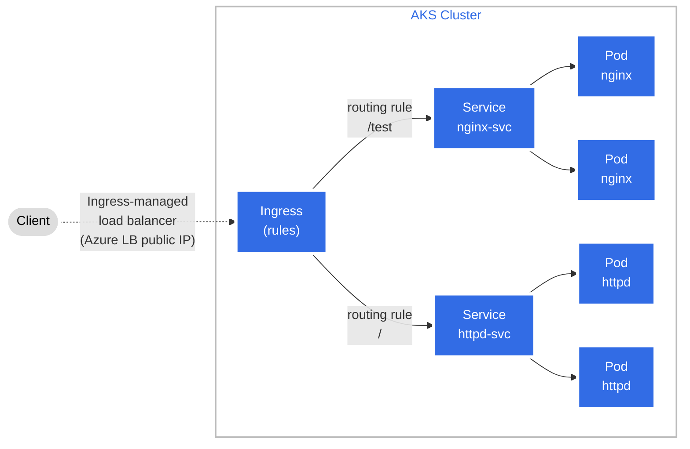
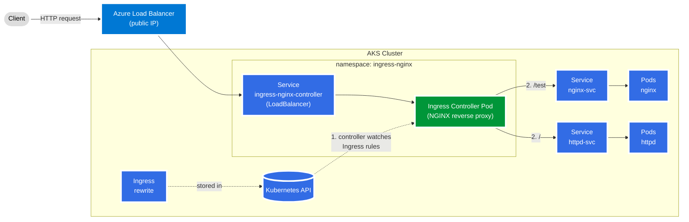
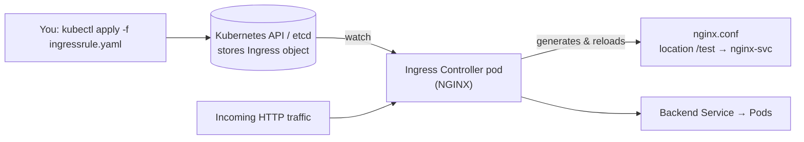
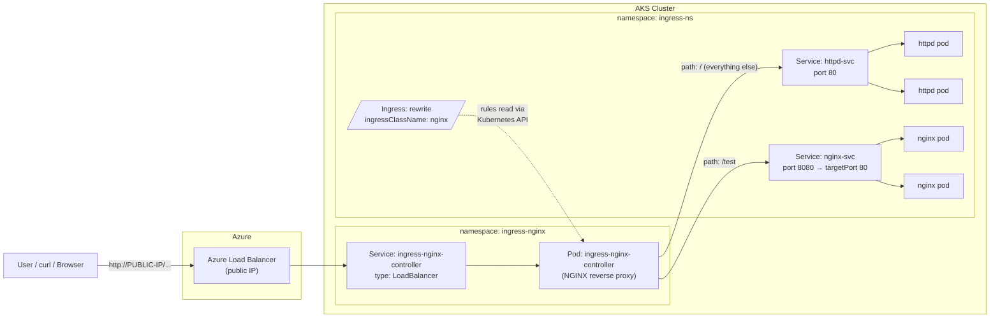
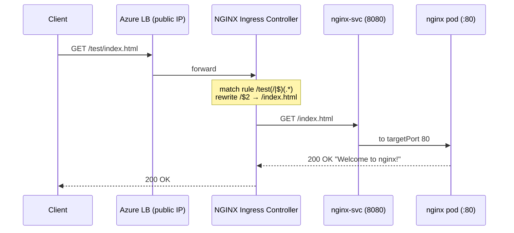

# Lab: NGINX Ingress Controller on AKS (Azure Kubernetes Service)

## Theory – What is Ingress?

### The problem
A Kubernetes **Service** of type `ClusterIP` is reachable only from inside the cluster. You can expose each app with its own `LoadBalancer` service, but on AKS every one of those gets its **own Azure public IP and load balancer rule**. With 10 apps you'd pay for and manage 10 public IPs, and you'd still have no URL-based routing, TLS termination or host names.

**Ingress** fixes this: **one public entry point** routes HTTP/HTTPS traffic to many internal services, based on the **host name** and **URL path**.

### What is Ingress?
**Ingress** is a Kubernetes API object (`kind: Ingress`, API group `networking.k8s.io/v1`) that defines **rules for routing external HTTP/HTTPS traffic to Services inside the cluster**.

Think of it as a **routing table** or a **receptionist's directory**: "visitors asking for `/test` go to room `nginx-svc`; everyone else goes to `httpd-svc`."

**Official Kubernetes diagram** (source: [kubernetes.io – Ingress](https://kubernetes.io/docs/concepts/services-networking/ingress/)):


The same idea as a Mermaid diagram, mapped to this lab:



An Ingress resource can define:
- **Path-based rules:** `/api` → `api-svc`, `/shop` → `shop-svc`
- **Host-based rules:** `app1.example.com` → `svc-1`, `app2.example.com` → `svc-2`
- **TLS:** which certificate (a TLS Secret) to use for HTTPS
- **Default backend:** where to send requests that match no rule
- **Annotations:** extra controller-specific behaviour, such as rewrites, timeouts, rate limits and CORS

Example (the core of this lab's rule):
```yaml
apiVersion: networking.k8s.io/v1
kind: Ingress
metadata:
  name: rewrite
spec:
  ingressClassName: nginx          # which controller should handle this
  rules:
  - http:
      paths:
      - path: /test                # if the URL path matches...
        pathType: Prefix
        backend:
          service:
            name: nginx-svc        # ...send it to this Service
            port:
              number: 8080
```

> ⚠️ **An Ingress resource does nothing on its own.** It is only configuration stored in the Kubernetes API (etcd). Something has to read it and act on it, and that something is the **Ingress Controller**.

### What is an Ingress Controller?
An **Ingress Controller** is the software that **puts Ingress rules into effect**. It's a **reverse proxy / L7 load balancer** that runs as pods inside the cluster and:

1. **Watches** the Kubernetes API for Ingress, Service, Endpoints and Secret objects.
2. **Turns** the Ingress rules into its own proxy configuration. For NGINX, it generates `nginx.conf` and reloads it automatically when an Ingress changes.
3. **Receives** all incoming HTTP/HTTPS traffic, through its own Service (type `LoadBalancer` on AKS).
4. **Routes** each request to the correct backend pods, based on host and path. It can also terminate TLS, apply rewrites, and so on.

Unlike Deployments or Services, **Kubernetes does not ship with an Ingress Controller**. You install one yourself, as Task 1 of this lab does.

How the Ingress Controller fits in (the controller is the piece that actually receives traffic and applies the Ingress rules):



Common Ingress Controllers:

| Controller | Notes |
|---|---|
| **ingress-nginx** | Community NGINX controller used in this lab (retired March 2026) |
| **AKS Application Routing add-on** | Microsoft-managed NGINX on AKS |
| **Application Gateway Ingress Controller (AGIC) / App Gateway for Containers** | Uses Azure Application Gateway outside the cluster as the proxy |
| **Traefik, HAProxy, Kong, Contour, Istio Gateway** | Other popular options |

You can see the controller's generated config in this lab with:
```
kubectl -n ingress-nginx exec deploy/ingress-nginx-controller -- cat /etc/nginx/nginx.conf | grep -A5 "location"
```

### Ingress vs Ingress Controller – in one line
| | Ingress | Ingress Controller |
|---|---|---|
| **What** | A YAML object holding routing **rules** | A running **proxy** that enforces the rules |
| **Kind** | `kind: Ingress` (configuration) | Deployment + Service (pods) |
| **Analogy** | The road signs / directory | The traffic police / receptionist |
| **Built into Kubernetes?** | ✅ The API object is | ❌ Must be installed |
| **In this lab** | `rewrite` in `ingress-ns` | `ingress-nginx-controller` in `ingress-nginx` |



### The building blocks

| Component | What it is | In this lab |
|---|---|---|
| **Ingress resource** | A Kubernetes object (YAML) holding routing **rules**: "requests for host/path X go to service Y". On its own it is just configuration and does nothing. | `rewrite` in namespace `ingress-ns` |
| **Ingress controller** | A pod (a reverse proxy) that **watches** Ingress resources and configures itself to apply their rules. Without a controller, Ingress objects have no effect. | `ingress-nginx-controller` in namespace `ingress-nginx` |
| **IngressClass** | Tells Kubernetes which controller handles an Ingress (`spec.ingressClassName`). Several controllers can run in one cluster. | `nginx` |
| **Controller Service** | How traffic reaches the controller. On AKS it's type `LoadBalancer`, so Azure assigns it a **public IP**. | `ingress-nginx-controller` (LoadBalancer) |
| **Backend Services** | Ordinary `ClusterIP` services in front of the app pods. | `httpd-svc:80`, `nginx-svc:8080` |
| **Endpoints** | The actual pod IP:port pairs behind each Service. NGINX sends traffic straight to them. | 2× httpd pods, 2× nginx pods |

### Architecture on AKS



### How a request flows
1. The client sends `GET http://<public-ip>/test/index.html`.
2. The **Azure Load Balancer** forwards it to a node, where the `ingress-nginx-controller` Service delivers it to the **controller pod**.
3. NGINX checks the request path against the rules from the Ingress resource. It matches `/test(/|$)(.*)`.
4. The **rewrite-target** annotation (`/$2`) removes the `/test` prefix, so the path becomes `/index.html`. Without the rewrite, the nginx pod would look for `/test/index.html` and return **404**.
5. NGINX proxies the request to one of the `nginx-svc` endpoints (an nginx pod on port 80) and returns the response to the client.



### Routing types
| Type | Example | Use |
|---|---|---|
| **Path-based** (this lab) | `ip/` → httpd, `ip/test` → nginx | Many apps under one host/IP |
| **Host-based** | `app1.example.com` → svc-1, `app2.example.com` → svc-2 | One app per (sub)domain (needs DNS records pointing at the public IP) |
| **TLS** | `spec.tls` + a TLS Secret | HTTPS terminated at the controller (often with cert-manager) |

**Path-based routing / fan-out** (official diagram, the type used in this lab):


**Host-based routing** (official diagram):


### pathType
- **Prefix**: matches on whole path segments (`/test` matches `/test` and `/test/a`, but not `/testing`).
- **Exact**: only the exact path matches.
- **ImplementationSpecific**: the controller decides. Needed here because the paths are NGINX **regex** patterns (`use-regex: "true"`).

### Ingress vs LoadBalancer vs NodePort
| | NodePort | LoadBalancer | Ingress |
|---|---|---|---|
| Layer | L4 (TCP/UDP) | L4 (TCP/UDP) | L7 (HTTP/HTTPS) |
| Public IPs | Uses node IPs (none on AKS by default) | **One per service** | **One shared** by all apps |
| Path/host routing | ❌ | ❌ | ✅ |
| TLS termination | ❌ | ❌ | ✅ |

> **Looking ahead:** Ingress is frozen (no new features). Its successor is the **Gateway API** (`Gateway` + `HTTPRoute`). On AKS, the managed options are the **Application Routing add-on** (managed NGINX) and **Application Gateway for Containers**.

---

## Prerequisites – Connect to the existing AKS cluster

Log in to Azure (or use **Azure Cloud Shell**, which already has `az` and `kubectl`):
```
az login
```
Select the subscription that holds the cluster (if you have more than one):
```
az account set --subscription <subscription-name-or-id>
```
Find your cluster name and resource group:
```
az aks list -o table
```
Set variables to match your cluster:
```
RG=<your-resource-group>
CLUSTER=<your-aks-cluster-name>
```
Download cluster credentials (install `kubectl` first with `az aks install-cli` if needed, skip in Cloud Shell):
```
az aks get-credentials --resource-group $RG --name $CLUSTER
```
Confirm `kubectl` is pointing at the right cluster and the nodes are `Ready`:
```
kubectl config current-context
```
```
kubectl get nodes -o wide
```

Check whether an ingress controller is already installed. If the `ingress-nginx` namespace or an `nginx` IngressClass already exists, **do not** apply the manifest in Task 1 again; skip to *Create a Namespace and Deploy Applications*, and **skip deleting the controller in Task 2**, because other teams may be using it:
```
kubectl get ns ingress-nginx
```
```
kubectl get ingressclass
```

> **Note:** The upstream `kubernetes/ingress-nginx` project was retired in March 2026 (no further releases or security fixes). It is fine for learning; for production on AKS use the managed **Application Routing add-on** (`az aks approuting enable -g $RG -n $CLUSTER`) or Gateway API.

---

## Task 1 – Deploy nginx-ingress-controller

Deploy the nginx-ingress-controller using the cloud-provider manifest.
(Version `v1.1.0` from older labs does not support current AKS Kubernetes versions, so a newer release is used.)
```
kubectl apply -f https://raw.githubusercontent.com/kubernetes/ingress-nginx/controller-v1.12.1/deploy/static/provider/cloud/deploy.yaml
```

Verify the namespace, deployment and pods:
```
kubectl get ns
```
```
kubectl -n ingress-nginx get all
```
Wait until the controller pod is `Running` and `1/1` ready:
```
kubectl -n ingress-nginx wait --for=condition=ready pod -l app.kubernetes.io/component=controller --timeout=180s
```

View controller logs (optional):
```
kubectl -n ingress-nginx logs deploy/ingress-nginx-controller
```

#### Azure Load Balancer health probe (required on AKS)
AKS integrates with Azure Load Balancer, so the `ingress-nginx-controller` service stays type **LoadBalancer** and gets a **public IP** — no need to switch to NodePort.
On AKS 1.24+ the Azure LB health probe must point at `/healthz`, otherwise the public IP will not respond:
```
kubectl -n ingress-nginx annotate svc ingress-nginx-controller service.beta.kubernetes.io/azure-load-balancer-health-probe-request-path=/healthz --overwrite
```
Watch until `EXTERNAL-IP` changes from `<pending>` to a public IP (1–2 minutes), then press `Ctrl+C`:
```
kubectl -n ingress-nginx get svc ingress-nginx-controller -w
```

---

#### Create a Namespace and Deploy Applications
Create a namespace named ***ingress-ns***:
```
kubectl create ns ingress-ns
```
Deploy Httpd and Nginx deployments:
```
kubectl -n ingress-ns create deployment httpd-dep --image httpd --port 80 --replicas 2
```
```
kubectl -n ingress-ns create deployment nginx-dep --image nginx --port 80 --replicas 2
```
Verify the deployed applications:
```
kubectl -n ingress-ns get deploy
```
```
kubectl -n ingress-ns get pods -o wide
```

Expose the deployments as ClusterIP services:
```
kubectl -n ingress-ns expose deployment httpd-dep --port 80 --name httpd-svc
```
The nginx service listens on **8080** but must forward to container port **80**:
```
kubectl -n ingress-ns expose deployment nginx-dep --port 8080 --target-port 80 --name nginx-svc
```

Verify the services and their endpoints:
```
kubectl -n ingress-ns get svc
```
```
kubectl -n ingress-ns get ep
```

---

#### Set Up Ingress Rules
Create a file named ***ingressrule.yaml***:
```
vi ingressrule.yaml
```
Copy the following Ingress rule into it.
`/test` and anything under it goes to **nginx-svc** (the `/test` prefix is stripped by the rewrite); everything else goes to **httpd-svc**.

```yaml
apiVersion: networking.k8s.io/v1
kind: Ingress
metadata:
  name: rewrite
  namespace: ingress-ns
  annotations:
    nginx.ingress.kubernetes.io/use-regex: "true"
    nginx.ingress.kubernetes.io/rewrite-target: /$2
spec:
  ingressClassName: nginx
  rules:
  - http:
      paths:
      - path: /test(/|$)(.*)
        pathType: ImplementationSpecific
        backend:
          service:
            name: nginx-svc
            port:
              number: 8080
      - path: /()(.*)
        pathType: ImplementationSpecific
        backend:
          service:
            name: httpd-svc
            port:
              number: 80
```
Apply the Ingress rule:
```
kubectl apply -f ingressrule.yaml
```
Verify the Ingress (the `ADDRESS` column shows the LoadBalancer public IP after ~1 minute):
```
kubectl -n ingress-ns get ingress
```
```
kubectl -n ingress-ns describe ingress rewrite
```

---

#### Verify Ingress Connectivity
Store the ingress public IP in a variable:
```
INGRESS_IP=$(kubectl -n ingress-nginx get svc ingress-nginx-controller -o jsonpath='{.status.loadBalancer.ingress[0].ip}')
echo $INGRESS_IP
```
Test the httpd app (expect `It works!`):
```
curl -v http://$INGRESS_IP/
```
Test the nginx app (expect `Welcome to nginx!`):
```
curl -v http://$INGRESS_IP/test
```

You can also open these in a browser (plain **http**, no port needed):
> http://&lt;INGRESS-PUBLIC-IP&gt;/  → httpd
> http://&lt;INGRESS-PUBLIC-IP&gt;/test  → nginx
> e.g. http://20.121.45.10/test

> **Why no NodePort / node public IP?** AKS nodes have no public IPs by default and sit behind the Azure Load Balancer. The LoadBalancer service is the AKS-native way to reach the ingress controller. Only use NodePort if your cluster has no LoadBalancer integration (e.g. a self-managed cluster).

---

## Task 2 – Cleanup all resources created above
Delete the application namespace (removes the deployments, services and ingress in it):
```
kubectl delete ns ingress-ns
```
Delete the ingress controller **only if this lab installed it** (also removes the Azure public IP / LB rule it created):
```
kubectl delete -f https://raw.githubusercontent.com/kubernetes/ingress-nginx/controller-v1.12.1/deploy/static/provider/cloud/deploy.yaml
```
Verify the cleanup (the existing AKS cluster itself is **not** deleted):
```
kubectl get ns
```
